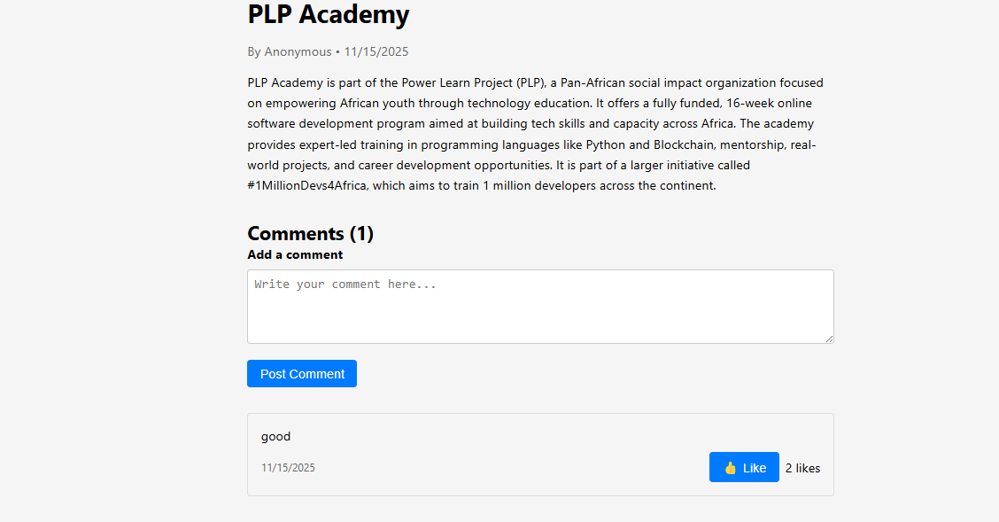
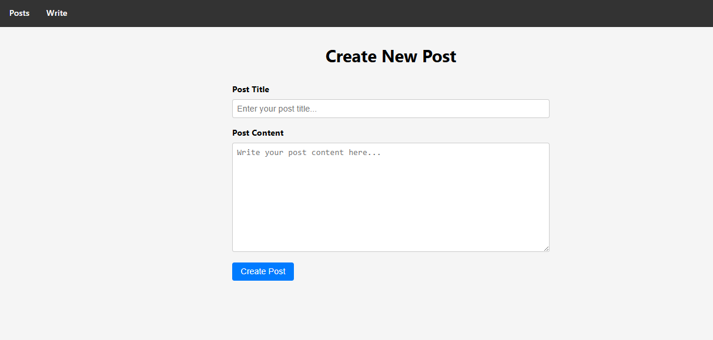

# MERN Stack Blog Application

A full-stack blog application built with the MERN stack (MongoDB, Express.js, React.js, Node.js) that demonstrates seamless integration between front-end and back-end components.

## Project Overview

This application provides a complete blogging platform with modern UI/UX, featuring post creation, viewing, commenting, and responsive design. The backend provides RESTful APIs for CRUD operations on blog posts and comments, while the frontend offers an intuitive interface for users to interact with the content.

## Features Implemented

### Backend Features
- **RESTful API**: Complete CRUD operations for blog posts
- **MongoDB Integration**: Data persistence with Mongoose ODM
- **Comment System**: Add comments to individual posts
- **Authentication Middleware**: JWT-based auth (middleware ready)
- **Error Handling**: Comprehensive error handling and validation
- **CORS Support**: Cross-origin resource sharing enabled

### Frontend Features
- **React Components**: Modular component architecture
- **Responsive Design**: Mobile-first responsive grid layout
- **Modern UI**: Card-based design with hover effects and shadows
- **Routing**: Client-side routing with React Router
- **Form Validation**: Client-side validation for post creation
- **Loading States**: User feedback during API calls
- **Comment System**: Interactive commenting with like functionality

### Key Components
- Post List Page: Responsive grid of blog posts
- Post Details Page: Individual post view with comments
- Create Post Page: Form for creating new blog posts
- Comment Form: Add comments to posts
- Comment List: Display and interact with comments

## Setup Instructions

### Prerequisites
- Node.js (v14 or higher)
- MongoDB (local or cloud instance)
- npm or yarn

### Installation

1. **Clone the repository**
   ```bash
   git clone <repository-url>
   cd mern-stack-integration-Kimanidavid
   ```

2. **Install dependencies**
   ```bash
   # Install root dependencies
   npm install

   # Install client dependencies
   cd client
   npm install
   cd ..
   ```

3. **Environment Configuration**
   Create a `.env` file in the root directory:
   ```env
   MONGODB_URI=mongodb://localhost:27017/mern-blog
   PORT=5000
   NODE_ENV=development
   JWT_SECRET=your_secret_key_change_this
   ```

4. **Start MongoDB**
   ```bash
   # Windows
   net start MongoDB

   # macOS/Linux
   sudo systemctl start mongod
   ```

5. **Run the application**
   ```bash
   npm run dev
   ```

The application will start on:
- Frontend: http://localhost:3003
- Backend API: http://localhost:5000

## API Documentation

### Posts Endpoints

| Method | Endpoint | Description | Auth Required |
|--------|----------|-------------|---------------|
| GET | `/api/posts` | Get all posts | No |
| GET | `/api/posts/:id` | Get single post | No |
| POST | `/api/posts` | Create new post | No |
| PUT | `/api/posts/:id` | Update post | Yes |
| DELETE | `/api/posts/:id` | Delete post | Yes |
| POST | `/api/posts/:id/comments` | Add comment to post | No |

### Request/Response Examples

**Create Post:**
```json
POST /api/posts
{
  "title": "Sample Blog Post",
  "content": "This is the content of the blog post...",
  "author": "User ID"
}
```

**Response:**
```json
{
  "_id": "post_id",
  "title": "Sample Blog Post",
  "content": "This is the content of the blog post...",
  "author": {
    "_id": "user_id",
    "name": "Author Name"
  },
  "comments": [],
  "createdAt": "2024-01-01T00:00:00.000Z",
  "updatedAt": "2024-01-01T00:00:00.000Z"
}
```

**Add Comment:**
```json
POST /api/posts/:id/comments
{
  "content": "This is a great post!"
}
```

## Project Structure

```
mern-stack-integration-Kimanidavid/
├── client/                 # React front-end
│   ├── public/             # Static files
│   ├── src/
│   │   ├── components/     # Reusable components
│   │   │   ├── common/     # Shared UI components
│   │   │   ├── postCard.jsx
│   │   │   ├── postList.jsx
│   │   │   ├── commentForm.jsx
│   │   │   └── commentList.jsx
│   │   ├── pages/          # Page components
│   │   │   ├── PostList.jsx
│   │   │   ├── PostDetails.jsx
│   │   │   └── CreatePost.jsx
│   │   ├── services/       # API services
│   │   ├── context/        # React context
│   │   ├── hooks/          # Custom hooks
│   │   └── App.jsx         # Main app component
│   └── package.json
├── server/                 # Express.js back-end
│   ├── controllers/        # Route controllers
│   ├── models/             # Mongoose models
│   ├── routes/             # API routes
│   ├── middleware/         # Custom middleware
│   └── server.js           # Main server file
├── .env                    # Environment variables
└── README.md               # This file
```

## Screenshots

### Post List Page

*Responsive grid layout displaying blog posts with modern card design*

### Post Details Page

*Individual post view with comments section*

### Create Post Page

*Form for creating new blog posts with validation*

## Technologies Used

- **Frontend**: React.js, React Router, CSS3
- **Backend**: Node.js, Express.js
- **Database**: MongoDB with Mongoose
- **Build Tool**: Vite
- **Development**: Concurrently, Nodemon

## Resources

- [MongoDB Documentation](https://docs.mongodb.com/)
- [Express.js Documentation](https://expressjs.com/)
- [React Documentation](https://react.dev/)
- [Node.js Documentation](https://nodejs.org/en/docs/)
- [Mongoose Documentation](https://mongoosejs.com/docs/)

# 🚀 Quick Start Guide

## Get Started in 3 Steps

### 1️⃣ Install Dependencies

```bash
# Install root dependencies
npm install

# Install client dependencies
cd client
npm install
cd ..
```

Or use the shortcut:
```bash
npm run install-all
```

### 2️⃣ Configure Environment

Create a `.env` file in the root directory:

```env
MONGODB_URI=mongodb://localhost:27017/mern-blog
PORT=5000
NODE_ENV=development
JWT_SECRET=your_secret_key_change_this
```

### 3️⃣ Run the Application

```bash
npm run dev
```

This starts:
- ✅ Backend server on http://localhost:5000
- ✅ Frontend app on http://localhost:3000

## 📝 What You Just Fixed

The error `npm error Missing script: "dev"` occurred because the package.json was missing the development scripts. 

### What Was Added:

**Root package.json scripts:**
```json
{
  "scripts": {
    "server": "nodemon server/server.js",
    "client": "cd client && npm run dev",
    "dev": "concurrently \"npm run server\" \"npm run client\"",
    "install-all": "npm install && cd client && npm install",
    "build": "cd client && npm run build",
    "start": "node server/server.js"
  }
}
```

**New files created:**
- ✅ `client/package.json` - React app dependencies
- ✅ `client/vite.config.js` - Vite configuration with proxy
- ✅ `client/index.html` - HTML entry point
- ✅ `client/src/main.jsx` - React entry point
- ✅ `client/src/index.css` - Global styles
- ✅ `.env.example` - Environment variables template

## 🎯 Next Steps

1. **Start MongoDB** (if using local):
   ```bash
   # Windows
   net start MongoDB
   
   # macOS/Linux
   sudo systemctl start mongod
   ```

2. **Run the app**:
   ```bash
   npm run dev
   ```

3. **Open your browser**:
   - Frontend: http://localhost:3000
   - Backend API: http://localhost:5000

## 🔧 Useful Commands

| Command | What it does |
|---------|--------------|
| `npm run dev` | Run both client & server |
| `npm run server` | Run backend only |
| `npm run client` | Run frontend only |
| `npm start` | Production mode |

## ❓ Still Having Issues?

Check the full [SETUP_GUIDE.md](./SETUP_GUIDE.md) for:
- Detailed troubleshooting
- MongoDB setup instructions
- API documentation
- Security best practices

## 📚 Project Structure

```
├── client/          # React frontend (Vite)
│   ├── src/
│   │   ├── components/
│   │   ├── pages/
│   │   └── services/
│   └── package.json
├── server/          # Express backend
│   ├── controllers/
│   ├── models/
│   └── routes/
├── .env            # Your environment variables
└── package.json    # Root dependencies
```

---

**You're all set! Happy coding! 🎉**
